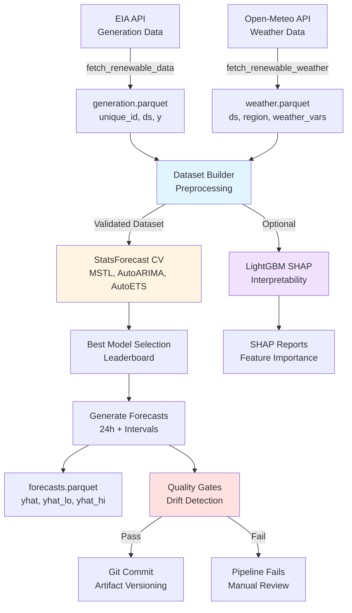

# Applied Time Series Analysis and Forecasting

## What is This?

Educational repository demonstrating **production-ready time series forecasting** with modern Python tools. This project combines academic rigor with practical engineering, focusing on real-world renewable energy forecasting using authoritative EIA data.

**Primary Use Case:** Automated 24-hour probabilistic forecasts for wind & solar generation across 5 US regions (CALI, ERCO, MISO, PJM, SWPP).


Streamlit: https://renewable-energy-forecasting.streamlit.app/
---

## Renewable Energy Forecasting Pipeline

Automated hourly pipeline that fetches EIA generation data, validates it, trains models via cross-validation, and generates calibrated probabilistic forecasts with prediction intervals.

### Architecture



### Why These Data Sources?

**EIA RTO Fuel-Type Data:**
- **Authoritative:** Official US electricity generation data from regional transmission operators
- **Coverage:** Hourly granularity covering 80%+ of US grid
- **Accessibility:** Free API with key (no usage limits)
- **Timeliness:** Real-time with 12-48h publishing lag (reflects reality)

**Open-Meteo Weather API:**
- **Free & Open:** No authentication required, unlimited requests
- **Leakage Prevention:** Separate historical + forecast endpoints
- **Relevant Variables:** 7 key features strongly correlated with generation:
  - Temperature (2m)
  - Wind speed (10m & 100m)
  - Solar radiation (direct & diffuse)
  - Cloud cover
- **Global Coverage:** Works for any lat/lon coordinate

### Key Design Decisions

**Why StatsForecast over Prophet/MLForecast?**
- ✅ Native multi-series support (10x faster than individual training)
- ✅ Built-in prediction intervals (no conformal prediction needed)
- ✅ Excellent with seasonal patterns (MSTL handles daily + weekly cycles)
- ✅ Battle-tested statistical models (ARIMA, ETS, Seasonal Naive)

**Why Strict Validation (Fail-Loud)?**
- ✅ Catch data quality issues early (no silent imputation)
- ✅ Missing hours → raise error (don't interpolate)
- ✅ Stale data → fail if lag > 48h
- ✅ Negative generation → investigate via EDA first
- **Result:** Trustworthy forecasts with explicit data issues

**Why RMSE/MAE over MAPE?**
- ⚠️ MAPE undefined when actuals = 0 (solar at night, wind during calm)
- ✅ RMSE: Standard metric, penalizes large errors
- ✅ MAE: Robust to outliers
- ✅ Coverage: Validates prediction interval calibration

**Why Git-Based Artifact Storage?**
- ✅ Full lineage: every forecast linked to exact code version
- ✅ Free storage (no S3/database setup)
- ✅ Enables reproducibility and rollback
- ✅ Natural integration with GitHub Actions

**Why Preprocessing Module (dataset_builder.py)?**
- ✅ Single source of truth for transformations
- ✅ Educational diagnostics at every step
- ✅ Transparent policies (negative handling, hourly grid)
- ✅ Testable and maintainable

---

## Quickstart

### Setup (5 minutes)

```bash
# Clone repository
git clone https://github.com/YOUR_ORG/atsaf.git
cd atsaf

# Install dependencies
pip install -e .

# Set EIA API key (get free key at https://www.eia.gov/opendata/)
export EIA_API_KEY="your_key_here"
```

### Run Pipeline (One Command)

```bash
# Fast development (24h forecast, 2 CV windows, 15 days lookback)
python -m src.renewable.tasks --preset 24h

# Standard forecasting (48h forecast, 3 CV windows, 21 days lookback)
python -m src.renewable.tasks --preset 48h

# Extended planning (72h forecast, 3 CV windows, 28 days lookback)
python -m src.renewable.tasks --preset 72h
```

### Run EDA (Understand the Data)

```bash
# Generate comprehensive EDA report
python scripts/run_eda_renewable.py

# Open HTML report (saved to reports/renewable/eda/YYYYMMDD_HHMMSS/eda_report.html)
```

### View Forecasts

```bash
# Launch interactive dashboard
streamlit run src/renewable/dashboard.py

# Or inspect outputs directly
ls data/renewable/
# generation.parquet, weather.parquet, forecasts.parquet,
# preprocessing_report.json, run_log.json
```

---

## Output Artifacts

### Forecasts (forecasts.parquet)

| unique_id | ds                  | yhat | yhat_lo_80 | yhat_hi_80 | yhat_lo_95 | yhat_hi_95 |
|-----------|---------------------|------|------------|------------|------------|------------|
| CALI_WND  | 2026-01-21 18:00    | 4250 | 3800       | 4700       | 3600       | 4900       |
| ERCO_SUN  | 2026-01-21 18:00    | 8500 | 7500       | 9500       | 7000       | 10000      |

**Columns:**
- `unique_id`: Region_FuelType (e.g., CALI_WND, ERCO_SUN)
- `ds`: Forecast timestamp (UTC)
- `yhat`: Point forecast (MW)
- `yhat_lo_80`, `yhat_hi_80`: 80% prediction interval
- `yhat_lo_95`, `yhat_hi_95`: 95% prediction interval

### Preprocessing Diagnostics (preprocessing_report.json)

```json
{
  "series_processed": 10,
  "rows_input": 15000,
  "rows_output": 14950,
  "negative_values_found": {
    "CALI_WND": {"count": 12, "min": -0.5, "max": -0.1, "ratio": 0.0008}
  },
  "negative_values_action": "clamped",
  "series_dropped_incomplete": [],
  "weather_coverage_by_region": {
    "CALI": 1.0,
    "ERCO": 0.998,
    "MISO": 1.0
  },
  "time_features_added": ["hour_sin", "hour_cos", "dow_sin", "dow_cos"],
  "weather_features_added": [
    "temperature_2m",
    "wind_speed_10m",
    "wind_speed_100m",
    "direct_radiation",
    "diffuse_radiation",
    "cloud_cover"
  ]
}
```

**Key Fields:**
- `negative_values_action`: What preprocessing did (clamped/failed/passed)
- `series_dropped_incomplete`: Series removed due to missing hours
- `weather_coverage_by_region`: Data completeness check

### Pipeline Summary (run_log.json)

```json
{
  "validation": {"ok": true, "lag_hours": 22.0},
  "quality_gates": {
    "rowdrop": {"ok": true, "drop_pct": 0.02},
    "drift": {"ok": true, "current_rmse": 1234, "threshold": 1500}
  },
  "pipeline_results": {
    "best_model": "MSTL_ARIMA",
    "best_rmse": 1234.5,
    "forecast_rows": 240
  },
  "preprocessing": {
    "rows_input": 15000,
    "rows_output": 14950,
    "series_dropped": 0,
    "negative_action": "clamped"
  }
}
```

**Quality Gates:**
- **Rowdrop**: Detects EIA API outages (≥30% row drop triggers failure)
- **Drift**: Statistical threshold (RMSE > mean + 2σ from CV)
- **Validation**: 10-step quality check (negatives, freshness, grid completeness)

---

## Production Deployment

### GitHub Actions (Automated)

Pipeline runs hourly via [.github/workflows/renewable_hourly.yml](.github/workflows/renewable_hourly.yml)

- **Schedule:** `:17` past each hour (`17 * * * *`)
- **Timeout:** 25 minutes
- **Artifacts:** Committed to main branch for versioning
- **Monitoring:** run_log.json tracks validation status

**Setup:**
1. Set `EIA_API_KEY` repository secret (Settings → Secrets → Actions)
2. Workflow triggers automatically on schedule
3. Check Actions tab for run history

### Local Development

```bash
# Manual run with custom config
export RENEWABLE_REGIONS="CALI,ERCO"
export LOOKBACK_DAYS=14
python -m src.renewable.jobs.run_hourly

# With interpretability disabled (faster)
export ENABLE_INTERPRETABILITY=false
python -m src.renewable.jobs.run_hourly
```

### Environment Variables

| Variable | Default | Description |
|----------|---------|-------------|
| `EIA_API_KEY` | *required* | EIA API key from https://www.eia.gov/opendata/ |
| `RENEWABLE_REGIONS` | `CALI,ERCO,MISO,PJM,SWPP` | Comma-separated region codes |
| `RENEWABLE_FUELS` | `WND,SUN` | Comma-separated fuel types |
| `LOOKBACK_DAYS` | `30` | Historical data to fetch |
| `RENEWABLE_HORIZON_PRESET` | - | Quick preset: `24h`, `48h`, `72h` |
| `ENABLE_INTERPRETABILITY` | `true` | Run LightGBM SHAP analysis |
| `MAX_LAG_HOURS` | `48` | Max acceptable data staleness |
| `VALIDATION_DEBUG` | `false` | Emit stepwise validation snapshots (schema/nulls/time/value stats) |

---

## Advanced Usage

### Custom Forecasting

```bash
# 36h forecast with 4 CV windows, only CALI/ERCO
python -m src.renewable.tasks \
  --horizon 36 \
  --cv-windows 4 \
  --lookback-days 30 \
  --regions CALI,ERCO

# Skip interpretability (faster pipeline)
python -m src.renewable.tasks --preset 24h --no-interpretability
```

### EDA with Filters

```bash
# EDA on specific date range
python scripts/run_eda_renewable.py \
  --start 2025-01-01 \
  --end 2025-12-31

# EDA on specific regions/fuels
python scripts/run_eda_renewable.py \
  --regions CALI,ERCO \
  --fuels WND
```

### Using Dataset Builder Programmatically

```python
from src.renewable.dataset_builder import build_modeling_dataset
import pandas as pd

# Load raw data
generation_df = pd.read_parquet("data/renewable/generation.parquet")
weather_df = pd.read_parquet("data/renewable/weather.parquet")

# Build modeling-ready dataset
modeling_df, prep_report = build_modeling_dataset(
    generation_df,
    weather_df,
    negative_policy="clamp",  # or "fail_loud" or "hybrid"
    hourly_grid_policy="drop_incomplete_series",
    output_dir="data/renewable/preprocessing"
)

# Check diagnostics
print(f"Input: {prep_report.rows_input:,} rows")
print(f"Output: {prep_report.rows_output:,} rows")
print(f"Negative action: {prep_report.negative_values_action}")
print(f"Series dropped: {len(prep_report.series_dropped_incomplete)}")
```

---

## Deep Dive Documentation

- **Full Architecture:** [RENEWABLE_PIPELINE_ARCHITECTURE.md](RENEWABLE_PIPELINE_ARCHITECTURE.md)
- **Architecture Decision Records:** [docs/adr/](docs/adr/)
- **EDA Guide:** [docs/EDA_GUIDE.md](docs/EDA_GUIDE.md) *(coming soon)*
- **Notebook Tutorial:** [chapters/renewable_energy_forecasting.ipynb](chapters/renewable_energy_forecasting.ipynb)

---

## Project Structure

```
atsaf/
├── src/renewable/              # Renewable energy forecasting pipeline
│   ├── eia_renewable.py        # EIA data fetcher
│   ├── open_meteo.py           # Weather data fetcher
│   ├── dataset_builder.py      # Preprocessing with diagnostics (NEW)
│   ├── eda.py                  # Decision-driven EDA module (NEW)
│   ├── modeling.py             # StatsForecast + LightGBM models
│   ├── model_interpretability.py  # SHAP analysis
│   ├── validation.py           # Data quality checks
│   ├── tasks.py                # Pipeline orchestration
│   ├── regions.py              # Region metadata
│   ├── dashboard.py            # Streamlit visualization
│   └── jobs/
│       └── run_hourly.py       # Production entry point
├── scripts/
│   └── run_eda_renewable.py    # EDA CLI tool (NEW)
├── data/renewable/             # Data artifacts
│   ├── generation.parquet
│   ├── weather.parquet
│   ├── forecasts.parquet
│   ├── preprocessing_report.json  # (NEW)
│   └── run_log.json
├── reports/renewable/eda/      # EDA outputs (NEW)
│   └── YYYYMMDD_HHMMSS/
│       ├── eda_report.html
│       ├── seasonality/
│       ├── coverage/
│       ├── negative_values/
│       └── weather_alignment/
├── chapters/                   # Jupyter notebooks
│   └── renewable_energy_forecasting.ipynb
└── docs/                       # Documentation
    └── adr/                    # Architecture Decision Records (NEW)
```

---

## Key Features

✅ **Production-Ready Pipeline**
- Automated hourly runs via GitHub Actions
- Quality gates prevent bad forecasts
- Drift detection alerts on degradation
- Git-based versioning for full lineage

✅ **Educational Design**
- Decision-driven EDA (justifies every choice)
- Preprocessing diagnostics (transparent transformations)
- Architecture Decision Records (explains why)
- Comprehensive documentation

✅ **Fail-Loud Philosophy**
- No silent imputation (raises errors on missing data)
- Strict validation at every step
- Clear diagnostics when failures occur

✅ **Interpretable Models**
- SHAP analysis for feature importance
- Partial dependence plots
- Waterfall plots for single predictions
- Optional (can be disabled for speed)

✅ **Flexible Configuration**
- Preset system (24h/48h/72h) for common use cases
- Override any parameter via CLI
- Environment variable support
- Programmatic API

---

## Contributing

See [RENEWABLE_PIPELINE_ARCHITECTURE.md](RENEWABLE_PIPELINE_ARCHITECTURE.md) for:
- Module architecture details
- Known issues & areas for improvement
- Future roadmap

Contributions welcome! Focus areas:
- Additional regions (Northwest, Southwest, Southeast)
- Alternative models (Prophet, NeuralProphet)
- Enhanced drift detection
- Real-time alerting

---

## Book Content (Original Purpose)

This repository also hosts materials for the book "Applied Time Series Analysis and Forecasting with R".

### Roadmap

* `V1` - Foundation of time series analysis
* `V2` - Traditional forecasting methods (Smoothing, ARIMA, Linear Regression)
* `V3` - Advanced regression methods (GLM, GAM)
* `V4` - Bayesian forecasting approaches
* `V5` - Machine and deep learning methods
* `V6` - Scaling and production approaches

### Table of Contents

- [ ] Preface (V1)
- [ ] Introduction (V1)
- [ ] Prerequisites (V1)
- [ ] Dates and Times Objects (V1)
- [ ] The ts Class (V1)
- [ ] Working with APIs (V2)
- [ ] Data Prep & Quality for Time Series (V1/V2)
- [ ] Seasonal Analysis (V1)
- [ ] Correlation Analysis (V1)
- [ ] Forecasting Strategies (V2)
- [ ] Backtesting & Evaluation (V2)
- [ ] Forecasting with ARIMA Models (V2)
- [ ] Forecasting with Linear Regression (V2)
- [ ] Probabilistic Forecasting (V3)
- [ ] Forecasting at Scale (V6)
- [ ] **Forecasting in Production (V6)** ← *Renewable pipeline demonstrates this*

---

## License

This book is licensed under a [Creative Commons Attribution-NonCommercial-ShareAlike 4.0 International](https://creativecommons.org/licenses/by-nc-sa/4.0/) License.

---

## Get Started

```bash
# Install
pip install -e .

# Set API key
export EIA_API_KEY="your_key_here"

# Run 24h forecast
python -m src.renewable.tasks --preset 24h

# View results
streamlit run src/renewable/dashboard.py
```

**Questions?** Check the [documentation](docs/) or open an issue.

**Follow Progress:** [@AppliedTSAF](https://twitter.com/AppliedTSAF) | [Telegram](https://t.me/atsafr) | [GitHub Project](https://github.com/users/RamiKrispin/projects/4)
