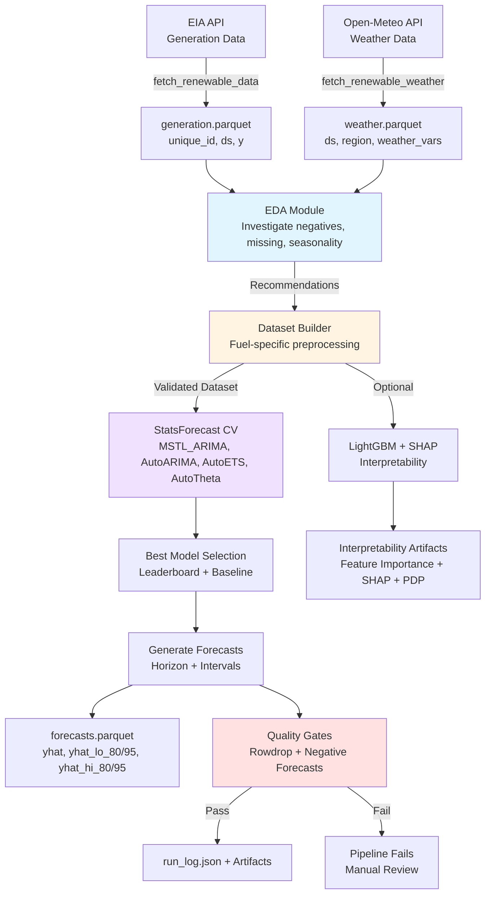

# Renewable Energy Forecasting Pipeline - LinkedIn Visual Guide

## The Visual (for creating in Figma/Canva/draw.io)

### Mermaid Graph (use in docs or the post)



### High-Level ASCII Visual

```
┌──────────────────────────────────────────────────────────────────────────────┐
│                    RENEWABLE ENERGY FORECASTING PIPELINE                     │
│                 24–72h Probabilistic Forecasts for Wind & Solar              │
└──────────────────────────────────────────────────────────────────────────────┘
    ┌──────────────────────┐                  ┌──────────────────────┐
    │  EIA API             │                  │  Open-Meteo API       │
    │  Generation          │                  │  Weather (Hist+Fcst)  │
    │  • Wind / Solar MWh  │                  │  • 7 Weather Vars     │
    │  • 5 US Regions      │                  │  • No leakage         │
    └──────────┬───────────┘                  └──────────┬───────────┘
               │                                         │
               └──────────────┬──────────────────────────┘
                              ▼
                  ┌──────────────────────────┐
                  │   EDA + PREPROCESSING    │
                  │  • Negative investigation│
                  │  • Hourly grid enforcement│
                  │  • Time features         │
                  │  • Weather alignment     │
                  └───────────┬──────────────┘
                              ▼
                  ┌──────────────────────────┐
                  │     MODELING (CV)        │
                  │  StatsForecast Models    │
                  │  • MSTL_ARIMA (best)     │
                  │  • AutoARIMA / AutoETS   │
                  │  • AutoTheta / Naive     │
                  └───────────┬──────────────┘
                              ▼
                  ┌──────────────────────────┐
                  │  FORECASTS + INTERVALS   │
                  │  • 24h horizon default   │
                  │  • 80% / 95% intervals   │
                  │  • Clip to >= 0          │
                  └───────────┬──────────────┘
                              ▼
         ┌────────────────────┼────────────────────┐
         ▼                    ▼                    ▼
  ┌────────────┐      ┌────────────────┐   ┌──────────────────┐
  │ run_log.json│      │ Streamlit      │   │ Drift + Gates     │
  │ artifacts   │      │ Dashboard      │   │ Rowdrop / Neg     │
  └────────────┘      └────────────────┘   └──────────────────┘
```

---

## Step-by-Step Build Choices (What I Actually Did)

1. **Pull generation data from EIA (hourly)** for multiple ISO/RTO regions and two fuels (WND, SUN). The fetcher is resilient (pagination, retries) and logs coverage per series.
2. **Pull weather data from Open-Meteo** using *historical endpoints for training* and *forecast endpoints for prediction* to avoid leakage.
3. **Run EDA first** to understand negative values, missing data, seasonality, and zero inflation (especially solar at night). EDA outputs a `recommendations.json` with preprocessing policies.
4. **Build modeling datasets per fuel type** (wind vs solar) using those EDA recommendations. This step:
   - clamps negative generation to zero when recommended,
   - enforces a complete hourly grid (drops incomplete series),
   - adds time features (hour/day-of-week sin/cos),
   - aligns weather to timestamps (drops rows with missing weather).
5. **Train models with StatsForecast** using cross-validation (adaptive windows based on shortest series) and compare multiple statistical models.
6. **Select the best model by RMSE** and store a full leaderboard and baseline metrics in `run_log.json` for the dashboard.
7. **Generate forecasts** using the *min of per-series max timestamps* (not global max) to handle different publishing lags across regions.
8. **Enforce physical constraints** by clipping all forecasts and intervals to **>= 0** so no negative energy predictions leak out.
9. **Quality gates + drift checks** guard production:
   - rowdrop gate (detect API outages),
   - negative forecast ratio gate, and
   - drift detection (current RMSE vs baseline mean + 2*std).
10. **Expose everything in a Streamlit dashboard** with tabs for forecasts, drift, coverage, weather, EDA history, and interpretability.

---

## Key Engineering Decisions (with rationale)

### 1) Physical Constraint Enforcement (No Negative Generation)
**Problem:** Statistical models can output negatives due to Gaussian error assumptions. That violates physics.
**Solution:** Clip *all* forecasts and prediction intervals to `>= 0`. This is enforced both in CV and final forecasts.

### 2) EDA-Driven Preprocessing (Not Guesswork)
**Problem:** EIA reports occasional negative values (net generation / auxiliary load).
**Solution:** Run EDA first, then follow the recommended policy (typically `clamp_to_zero`). Preprocessing is transparent and logged.

### 3) Hourly Grid Enforcement (No Fabricated Data)
**Problem:** Time-series models require complete grids; gaps break seasonality modeling.
**Solution:** Drop series with too many missing hours (default 2% threshold). No imputation or fabricated points.

### 4) Per-Series Lag Handling (Correct Weather Alignment)
**Problem:** Regions publish at different times (MISO earlier than ERCO, etc.).
**Bad idea:** Use the global max timestamp, which breaks early series.
**Solution:** Use `min(per_series_max)` for aligning future weather and forecast start times.

### 5) Separate Historical vs Forecast Weather (No Leakage)
**Problem:** Using future weather observations would leak information.
**Solution:** Train on historical weather and predict with forecast weather from Open-Meteo.

### 6) Model Choice = StatsForecast + CV Leaderboard
**Why:** It supports multi-series forecasting with built-in prediction intervals and fast CV.
**Models tested:** MSTL_ARIMA, AutoARIMA, AutoETS, AutoTheta, SeasonalNaive.

### 7) Interpretability Without Sacrificing Forecast Quality
**Approach:** Use LightGBM + SHAP *only* for interpretability artifacts. Forecasts still come from statistical models that give better uncertainty.

---

## Model Selection Rationale (Data-Scientist View)

**Goal:** A repeatable, evidence-driven selection process, not a one-off favorite.

### Why each model is in the leaderboard
- **MSTL_ARIMA**: Best when data has *multiple seasonalities* (daily + weekly). It decomposes trend/seasonality before ARIMA, which matches hourly grid patterns in energy data.
- **AutoARIMA**: Strong general-purpose baseline that adapts (p,d,q) automatically; good when seasonality is present but less complex.
- **AutoETS**: Works well on smoother series with stable trend/seasonality; faster, interpretable, and competitive when variance is lower.
- **AutoTheta**: Robust to level shifts and outliers; valuable when generation regimes change or weather drives abrupt shifts.
- **SeasonalNaive**: A strict baseline (same hour last week). If a model can’t beat this, it’s not adding value.

### How the winner is chosen (objective rule)
1. **Primary metric = RMSE** from time-series cross-validation (rolling windows).
2. **Secondary check = Coverage**: 80% and 95% intervals should be close to nominal.
3. **Baseline check**: Winner must beat SeasonalNaive meaningfully.
4. **Operational check**: Forecasts and intervals must remain **non-negative**.

### How to report “best model” in the post
- Pull `best_model` and `best_rmse` from `data/renewable/run_log.json` (dashboard uses this).
- Example phrasing:
  - “**Best model for this run: {best_model}** (lowest RMSE on CV, good interval coverage).”
  - “**Why it won:** {brief reason tied to seasonality/variance or stability}.”

---

## Dashboard Highlights (from `src/renewable/dashboard.py`)

- **Forecasts Tab**: Interactive 24h forecasts with 80%/95% intervals and local time display.
- **Drift Tab**: Alerts + stability summaries from baseline RMSE thresholds.
- **Coverage Tab**: Calibration checks (nominal vs empirical coverage).
- **Weather Tab**: Region-specific weather feature plots.
- **Interpretability Tab**: Feature importance, SHAP summary, PDPs, and waterfall plots.
- **Insights Tab**: Mermaid architecture, region context, EDA history, and model leaderboard.

---

## LinkedIn Post Template (Updated, Long-Form)

```
Built a production ML pipeline for renewable energy forecasting.

The challenge: Predict 24–72 hours of wind & solar generation across major US regions
using only public grid + weather data — and make it production-grade.

What started as “make a forecast” quickly became “make it reliable when the data is imperfect.”
Here’s the build flow and the main problems I solved.

Data ingestion (generation + weather)
I pull hourly generation from the EIA API and weather from Open-Meteo. Weather is pulled two ways
on purpose: historical for training, forecast for prediction, so evaluation stays honest.

Problem 1: Negative generation values
I expected wind and solar to be non-negative, but raw data includes negatives. Instead of silently
cleaning, I ran EDA first to measure how often it happens, where it happens, and how it affects
downstream modeling. That produces a logged preprocessing policy that the dataset builder applies
consistently.

Problem 2: Missing hours and irregular grids
Time-series models assume a complete hourly grid. Gaps break seasonality learning and CV.
I chose not to impute because that manufactures signal. Series that exceed missingness thresholds
are dropped, and the remaining data is enforced onto a complete hourly index.

Problem 3: Regions publish on different lags
Not every region updates at the same time. A global “latest timestamp” makes some series invalid.
I fixed this by aligning forecast start times using the most conservative common cutoff across
series so every region’s forecast is anchored to valid data.

Modeling and selection
I trained multiple StatsForecast models under cross-validation and stored a leaderboard for
comparison. The goal was not a single favorite model, but a repeatable selection process that
can be rerun as new data arrives.

Final issue: Negative forecasts from statistical models
Even after cleaning, statistical models can output negatives due to error assumptions. Since
power generation cannot be negative, I enforce a non-negative constraint on point forecasts and
prediction intervals so the system never publishes physically impossible values.

Production checks and monitoring
Quality gates and drift monitoring keep it reliable: rowdrop checks for API issues, negative
forecast ratio checks, and performance drift alerts relative to CV baselines.

If you have feedback on the dashboard or what you’d want in a production readiness checklist
for time-series forecasting, I’d love to hear it.

Stack: Python, EIA API, Open-Meteo, StatsForecast, Streamlit, LightGBM + SHAP

7 engineering choices that made it work (short list):

1) Physical constraints
Energy can't be negative. Forecasts + intervals are clipped to >= 0 in both CV and production.

2) EDA-driven preprocessing
I run EDA first, then apply explicit policies (clamp negatives, drop incomplete series).
No hidden data cleaning.

3) Hourly grid enforcement
Gaps break seasonal models. I drop series with too many missing hours instead of imputing.

4) Per-series lag alignment
Regions publish at different times. I align to min(per-series max) so forecasts stay valid.

5) Separate historical vs forecast weather
Training uses historical weather; prediction uses forecast weather. No leakage.

6) Cross-validated model leaderboard
MSTL_ARIMA, AutoARIMA, AutoETS, AutoTheta, SeasonalNaive — best model chosen by RMSE.

7) Production gates + drift monitoring
Rowdrop gate, negative forecast ratio gate, and drift thresholds from CV baselines.

Stack: Python, StatsForecast, Open-Meteo, EIA API, Streamlit, SHAP

#MachineLearning #DataEngineering #RenewableEnergy #TimeSeries #Python
```

---

## Suggested Visual Layout for LinkedIn

### Option A: Single Infographic (Recommended)
**Dimensions:** 1200 x 1500 px (portrait)
**Sections:**
1. Header: "Renewable Energy Forecasting Pipeline"
2. Mermaid/flow diagram (simplified)
3. Step-by-step pipeline decisions (EDA → preprocessing → modeling → gates)
4. Model leaderboard + coverage callout
5. CTA: link to repo or dashboard

### Option B: Carousel (6 slides)
1. **Cover:** "Building a Production Renewable Forecasting Pipeline"
2. **Data Sources:** EIA + Open-Meteo (no leakage)
3. **Preprocessing + EDA:** Negative handling + hourly grid
4. **Modeling:** StatsForecast CV + leaderboard
5. **Quality Gates + Drift:** Reliability controls
6. **Dashboard + Interpretability:** Streamlit + SHAP artifacts

---

## ASCII Diagram for Quick Reference

```
┌────────────────────────────────────────────────────────────┐
│                      DATA SOURCES                          │
├────────────────────────────────────────────────────────────┤
│  ⚡ EIA API                    🌤️ Open-Meteo               │
│  • Wind/Solar MWh              • 7 Weather Variables        │
│  • 5 US Regions                • Historical + Forecast      │
│  • 12–48h publishing lag       • Forecast endpoint (future) │
└──────────────────────────┬─────────────────────────────────┘
                           │
                           ▼
┌────────────────────────────────────────────────────────────┐
│              EDA + DATASET BUILDER                         │
├────────────────────────────────────────────────────────────┤
│  ✓ Negative investigation → clamp_to_zero                 │
│  ✓ Hourly grid enforcement (drop incomplete)              │
│  ✓ Time features (hour/dow sin/cos)                       │
│  ✓ Weather alignment + missing weather drops              │
└──────────────────────────┬─────────────────────────────────┘
                           │
                           ▼
┌────────────────────────────────────────────────────────────┐
│                MODELING & VALIDATION                       │
├────────────────────────────────────────────────────────────┤
│  📈 StatsForecast CV models                                │
│  • MSTL_ARIMA (multi-seasonal)                             │
│  • AutoARIMA / AutoETS / AutoTheta / Naive                 │
│  • RMSE leaderboard + baseline metrics                     │
└──────────────────────────┬─────────────────────────────────┘
                           │
                           ▼
┌────────────────────────────────────────────────────────────┐
│                    OUTPUTS                                 │
├────────────────────────────────────────────────────────────┤
│  📊 24–72h Forecasts          🛡️ Quality Gates             │
│  • Point estimates            • Rowdrop check              │
│  • 80% / 95% intervals         • Negative forecast ratio    │
│  • Clip to >= 0                • Drift detection (RMSE)     │
│                                                            │
│  📦 run_log + artifacts        📈 Streamlit dashboard       │
└────────────────────────────────────────────────────────────┘
```
